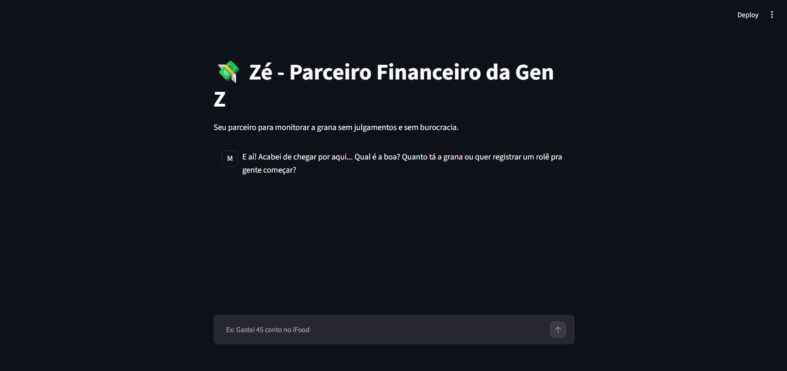

# 💸 Zé - Parceiro Financeiro da Gen Z
> Projeto desenvolvido como parte do desafio prático do **Bootcamp Bradesco - GenIA, Dados & Cyber** em parceria com a **DIO**.

## Sumário

1. [Preview](#preview)
2. [Visão Geral](#visão-geral)
3. [Funcionalidades](#funcionalidades)
4. [Tecnologias Utilizadas](#tecnologias-utilizadas)
5. [Estrutura do Repositório](#estrutura-do-repositório)
6. [Guia de Instalação e Execução](#guia-de-instalação-e-execução)
7. [Métricas e Desempenho do Modelo](#métricas-e-desempenho-do-modelo)
8. [Autor](#autor)

---

## Preview


---

## Visão Geral

Assistente financeiro pessoal inteligente e descontraído, desenvolvido como projeto para o laboratório da DIO. O "Zé" foi criado especificamente para o público da Gen Z, focando-se no controle de gastos do dia a dia de forma leve, sem burocracia e com **zero julgamentos**.

---

## Funcionalidades

- **Começa do Zero:** O assistente simula um primeiro acesso real, ele não sabe o nome do utilizador e inicia com o saldo completamente zerado (`R$ 0,00`).
- **Persona Única:** Comunicação com gírias atuais, emojis moderados, tom empático e total ausência dos sermões morais tradicionais.
- **Gestão de Transações Locais:** Registro dinâmico de entradas e despesas diárias geridas através de persistência em ficheiro local.
- **Interface Moderna**: Desenvolvido com **Streamlit** para proporcionar uma experiência de chat fluida e interativa.

---

## Tecnologias Utilizadas

- **Python** (Linguagem principal)
- **Streallit** (Interfaxe gráfica web)
- **Google GenAI SDK** (Integração com a IA)
- **Python-dotenv** (Gestão segura de variáveis de ambiente)
- **JSON/TXT** (Base de dados local e system prompt)

---

## Estrutura do Repositório

```
ze-parceiro-financeiro-dio/
 │
 ├── data/
 │   ├── transacoes.json    # Registo do saldo e transações do utilizador
 │   └── diretrizes.txt     # System prompt e regras de comportamento da persona
 │
 ├── app.py                 # Código principal da aplicação Streamlit e IA
 ├── requirements.txt       # Dependências do projeto
 ├── .env                   # Chave de API secreta (não versionada)
 └── README.md              # Documentação do projeto
```

---

## Guia de Instalação e Execução

### 1. Pré-Requisitos
Certifique-se de que tem o Python instalado no seu computador.

### 2. Clonar o repositório e instalar as dependências
Abra o terminal na pasta do projeto e instale os pacotes necessários:

``` Bash
pip install streamlit google-genai python-dotenv
```

### 3. Configurar a Chave de API
Crie um arquivo chamado `.env` na raíz do projeto e adicione sua chave da API:

``` Bash
GEMINI_API_KEY="a-sua-chave-aqui"
```

### 4. Executar a aplicação
Inicie o Streamlit através do terminal:

``` Bash
python -m streamlit run app.py
```

A aplicação abrirá automaticamente no seu navegador web padrão.

---

## Métricas e Desempenho do Modelo

O projeto passou por testes de validação focados em três pilares principais:

1. **Assertividade:** Respeito rigoroso pelo estado financeiro inicial (saldo zero) e consultas precisas.
2. **Segurança:** O assistente evita inventar nomes e recusa pedidos fora do escopo financeiro de forma controlada.
3. **Coerência:** Manutenção firme da persona da Geração Z em todas as interações.

---

## Autor

Desenvolvido por Guilherme Luiz Ribeiro da Silva / guissz

_Projeto prático desenvolvido para certificação no Bootcamp Bradesco - GenIA, Dados & Cyber pela DIO_